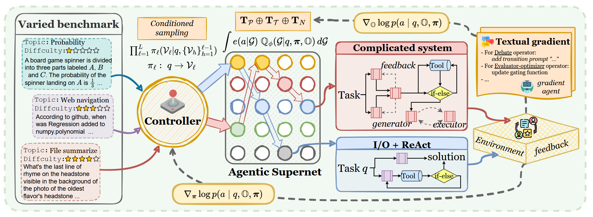

<<<<<<< HEAD
# MaAS

The source code will be available before April 30th, 2025.
=======
# MaAS: Multi-agent Architecture Search via Agentic Supernet

## 📰 News

🚩 Updates (2025-2-06) Initial upload to arXiv [PDF](https://arxiv.org/abs/2502.04180).


## 🤔What is MaAS?

We for the first time shift the paradigm of automated multi-agent system design from seeking a (possibly non-existent) single optimal system to optimizing a probabilistic, continuous distribution of agentic architectures, termed the **agentic supernet**. 


## 👋🏻Method Overview

Building on this concept, we propose **MaAS**, which dynamically samples multi-agent systems that deliver satisfactory performance and token efficiency for user queries across different domains and varying levels of difficulty.We believe that MaAS paves the way toward fully automated, self-organizing, and self-evolving collective intelligence.



## 🏃‍♂️‍➡️ Quick Start

### 📊 Datasets

Please download the  `GSM8K`,  `HumanEval`, `MATH`datasets and place it in the `maas\ext\maas\data` folder. The file structure should be organized as follows:

```
data
└── gsm8k_train.jsonl
└── gsm8k_test.jsonl
└── ......
```

### 🔑 Add API keys

You can configure `~/.metagpt/config2.yaml` according to the example.yaml. Or you can configure `~/config/config2.yaml`.

```python
llm:
  api_type: "openai" 
  model: "gpt-4o-mini" 
  base_url: ""
  api_key: ""
```

### 🐹 Run the code

The code below verifies the experimental results of the `HumanEval` dataset.

```bash
python -m examples.maas.optimize --dataset HumanEval --round 1 --sample 4 --exec_model_name "gpt-4o-mini"
python -m examples.maas.optimize --dataset HumanEval --round 1 --sample 4 --exec_model_name "gpt-4o-mini" --is_test True
```

## 📚 Citation

If you find this repo useful, please consider citing our paper as follows:

```bibtex
@misc{zhang2025multiagentarchitecturesearchagentic,
      title={Multi-agent Architecture Search via Agentic Supernet}, 
      author={Guibin Zhang and Luyang Niu and Junfeng Fang and Kun Wang and Lei Bai and Xiang Wang},
      year={2025},
      eprint={2502.04180},
      archivePrefix={arXiv},
      primaryClass={cs.LG},
      url={https://arxiv.org/abs/2502.04180}, 
}
```

## 🙏 Acknowledgement

Special thanks to the following repositories for their invaluable code and prompt.

Our prompt is partially adapted from [ADAS](https://github.com/ShengranHu/ADAS), [AgentSquare](https://github.com/tsinghua-fib-lab/AgentSquare/tree/main), and [AFLOW](https://github.com/geekan/MetaGPT/tree/main/examples/aflow). Our code and operators are partially adapted from [AFLOW](https://github.com/geekan/MetaGPT/tree/main/examples/aflow).
>>>>>>> 8a2e4e8 (Initial commit)
